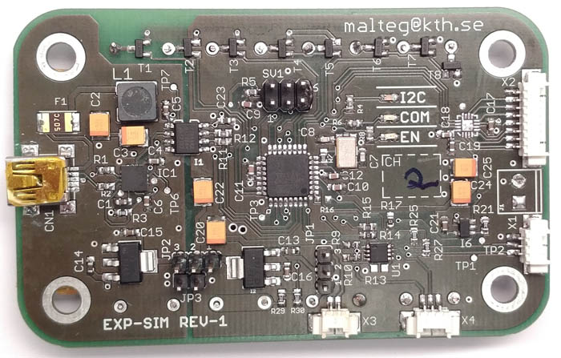
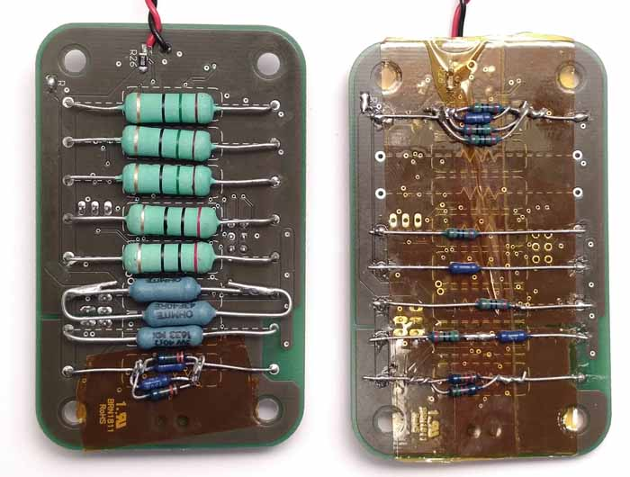
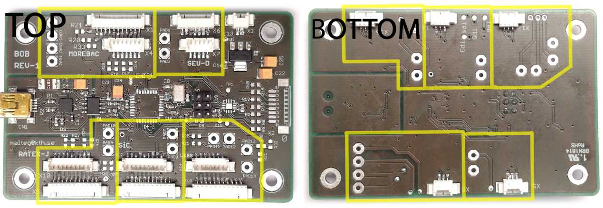
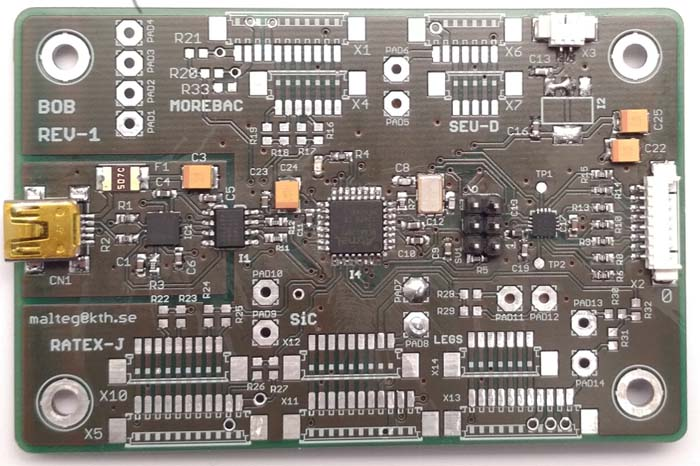

# CubeSat Testing
This repository contains files relating to my master thesis. While the focus of the thesis was on hardware, I did work quite a bit on software as well. That said, the software that exists is more of a proof of concept than a release-ready framework. It was created because I had fun and I share it in the hope that It might be of some use.

## Content
This repository contains both code for a test coordination system and hardware for physical testing, code that is embedded into the hardware is also included.
 ## Hardware

### Experiment Simulator
The experiment simulators are PCBs that can emulate the electrical load from a satellite subsystem. They are desinged to provide a dynamic load as to produce realistic power telemetry and provide a realistic load for the satellite's electrical power system. 

The load is made up by resistors that can be switched with MOSFET tranistors.

### Programming the experiment simulator
The experiment simulator can be programmed using the Arduino IDE. It behaves like a regular Arduino UNO with the exception that it has to be manually reset before programming. This is best done by pulling the reset line down at the same time as hitting "compile and upload" in the Arduino IDE. The LED of the experiment simulator will blink while the bootloader listens for commands from the IDE.

### Reflashing the bootloader
Loading the bootloader is done in the same (Read this section and warning at the end!!) way [as described here](https://www.arduino.cc/en/Tutorial/ArduinoToBreadboard) with the exception that if it is programmed with a 5 V Arduino it should not be powered from an external source. It is fine to power the experiment simulator this way even though the 3.3 V rail is set to 5 V, the voltage regulator seems to have no issues with this. **OBS!! All parts of the experiment simulator will be sitting at 5 V including the pull-up for the I2C bus. Disconnect from the satellite!!**

### Breakout Board
The breakout board is used to safly connect the experiment simulators to the satellite. By using the same cable lenghts as in flight the effect off cabling on the I2C bus can be tested.

### Sun Sensor Simulator
This PCB can simulate the satellites sun-sensors and is used for testing the Attitude Determination and Control system.

## QuizCube
QuizCube is an experimental testing system for coordinating test system interactions using a web socket based broad cast commuinication interface.

### Experiment Simulator Client
